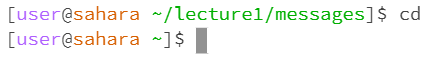
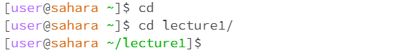
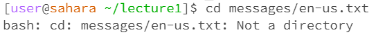
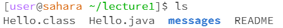
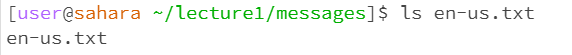
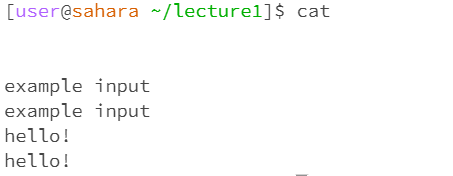
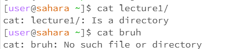
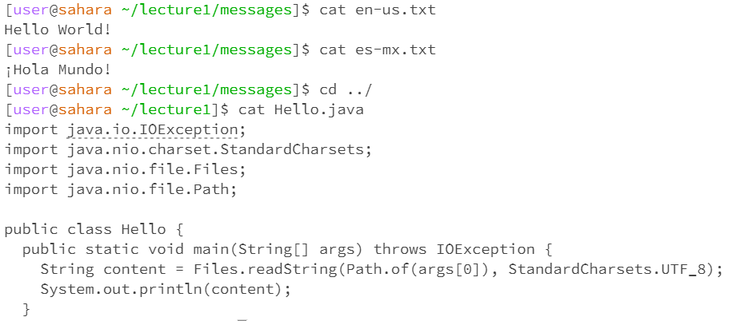

# CSE15L Week 1 Lab Report - Remote Access and FileSystem 

# cd command
The cd command stands for "current directory" and it is used to move between directories.
## cd no arguments

Using cd with no arguments resets the current directory to the home directory, also known as /home. I was in the `~/lecture1/messages directory`, using cd reset me to home.
This is not an error and is an intentional/useful way for easy access to the home directory.

## cd to a directory

Using cd with directory as an argument is used to change and move inbetween directories. This allows easy access to the files in the directory. To move backwards to parent directories, use `../`
This is not an error and allows movement to directories for running commands in that directory.

## cd to a file

Using cd with a file as an argument is an **error**. This is because a file is not a directory and so the command "change directory" will not work. 
A directory is a filesystem with multiple files in it, and so a single file can not be a directory. 

# ls command
This lists the names of directories and files, depending on the specified argument.

## ls no arguments

Using ls with no arguments gives the list of files that is in the current directory you are in. The current working directory is `~/lecture1`, and so it outputs the files and directories within lecture1.

## ls to directory

Using ls with a directory gives the list of files of the specified directory. If the specified directory doesn't exist or isn't in the current working directory it will cause an error. Here the current directory is home so it can list the contents of the directory `~/lecture1` and is not an error.

## ls to a file

Using ls on a file just displays the mentioned filename. If the file doesn't exist in the current directory it will cause an error. The current directory is `~/lecture1/messages/` which can then access en-us.txt within it, so using ls on the file displays the listed filename.

# cat command
Also known as concatenate, this command reads data from a file and outputs it. The text of the file is outputted.

## cat with no arguments

Using cat with no arguments waits for the user to input something, and then duplicates it as the output. It is a way to check human input and if it works by spitting the input back. The directory doesn't necessarily matter but this one is in directory `lecture1/`, and there aren't any errors.

## cat to a directory

Cat on an existing directory will confirm that the directory exists or not in the current working directory. If it doesn't exist it will say that there is no file or directory, which is an error. Otherwise its just another confirmation command checking if the directory is there.

## cat to a file

Cat with a file argument outputs the data and text within the file. On a .txt file it outputs the text within the file, or on a .java file it outputs all the code in the file. This is not an error and is the main way to use cat
