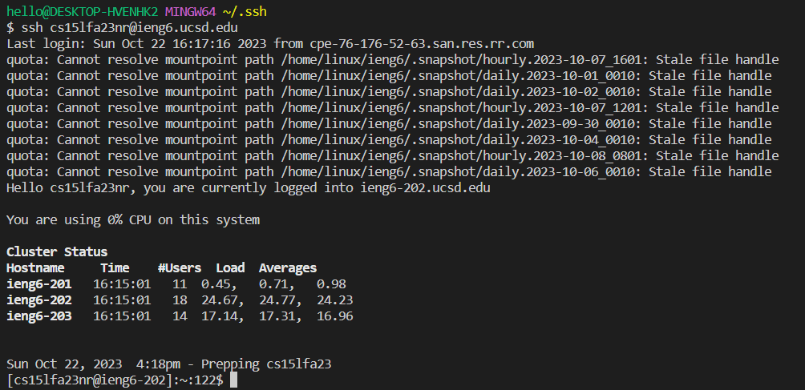

# CSE15L Week 3 Lab Report - VSCode and Your Local Machine
# Part 1: StringServer
## Code for StringServer.java
```
import java.io.IOException;
import java.net.URI;
import java.util.ArrayList;
import java.util.List;

class Handler implements URLHandler {
    // The one bit of state on the server: a number that will be manipulated by
    // various requests.

    List<String> listOfStrings = new ArrayList<>();

    public String handleRequest(URI url) {
        if (url.getPath().equals("/")) {
            return String.format("This is the homepage. Use /add-message");
        }
        else {
            if (url.getPath().contains("/add-message")) {
                String[] parameters = url.getQuery().split("=");
                if (parameters[0].equals("s")) {
                    String message = parameters[1];
                    listOfStrings.add(message);
                    StringBuilder output = new StringBuilder();

                    for (int i = 0; i < listOfStrings.size(); i++) {
                        output.append((i + 1) + ". " + listOfStrings.get(i) + "\n");
                    }

                    return output.toString();
                }
            }
            return "404 Not Found!";
        }
    }
}

class StringServer {
    public static void main(String[] args) throws IOException {
        if(args.length == 0){
            System.out.println("Missing port number! Try any number between 1024 to 49151");
            return;
        }

        int port = Integer.parseInt(args[0]);

        Server.start(port, new Handler());
    }
}
```

# Using add-message/


The method first called within the class Handler is `handleRequest` which takes in the URL as an argument. It checks the path of the URL and if it contains "\add-message". It then gets the query of the URL and splits it into two parameters before and after the `=`, checking if `s` is the first parameter to indicate that it's a string. Then the second parameter, in this case is "Hello" will then be added into the array list of strings. A StringBuilder is declared to help return an output to the website, and a for loop is done to build the output with append to finally return. The relevant arguments are pretty much the parameters of the URL along with the \add-message part indicating to add a message, along with the "Hello" string.

The main values that change is that the `listOfStrings` gets added the new string, where the string is now stored in the list. So now it currently only has "Hello" stored as the first element of the list. Also another thing that changes is the StringBuilder `output` where it appends a number and the added string so that when it outputs to the website.


The method first called within the class Handler is `handleRequest` which takes in the URL as an argument. Then it checks the path of the URL and if it contains "\add-message" which is true. It then gets the query of the URL and splits it into two parameters before and after the `=`, checking if `s` is the first parameter. Tthe second parameter, in this case is "How are you" will then be added into the array list of strings. A StringBuilder is declared to help return an output to the website, and a for loop is done to build the output with append to finally return. The relevant arguments are pretty much the parameters of the URL along with the \add-message part indicating to add a message, along with the "How are you" string.

Now that "Hello" was previously stored, it adds yet another whole string "How are you" as the second element of the list. The StringBuilder output appends the newly added string with a number to the host.

# Part 2: SSH keys and password

## Path to private key 


`/c/Users/hello/.ssh/id_rsa` (note: hello is the name of my local computer)

## Path to public key


`/home/linux/ieng6/cs15lfa23/cs15lfa23nr/.ssh/authorized_keys`

## Logging in with no password





# Part 3

Overall I learned a lot about how URLs and servers worked. Making StringServer based off NumberServer was interesting seeing how URI commands work like getPath and getQuery, along with split to obtain the parameters. I also learned a lot about /java since I'm a transfer student that hadn't worked with java before. The skill demonstration also taught me compiling and running a server, along with the specific commands needed too like `javac` for the two files and then using `java` with a port.
