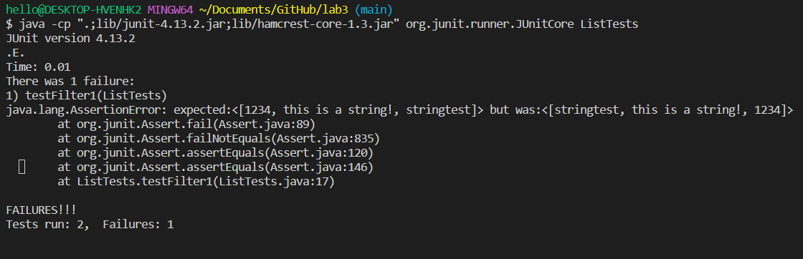

# CSE15L Week 5 Lab Report - Bugs and Commands
# Part 1: Bugs
## Finding bugs in ListExamples.java's filter function
## JUnit test with failure inducing input 

```
@Test 
public void testFilter1() {
  StringCheck sc = new StringCheck();
  List<String> testList = new ArrayList<>();
  
  testList.add("1234");
  testList.add("this is a string!");
  testList.add("stringtest");
  
  assertEquals(testList, ListExamples.filter(testList, sc));
}
```

## Junit test with no failure
```
@Test 
public void testFilter2() {
  StringCheck sc = new StringCheck();
  List<String> testList = new ArrayList<>();

  testList.add("only one string");

  assertEquals(testList, ListExamples.filter(testList, sc));
  }
```

## Output of the tests



## Before code change
```
static List<String> filter(List<String> list, StringChecker sc) {
  List<String> result = new ArrayList<>();
  for(String s: list) {
    if(sc.checkString(s)) {
      result.add(0, s);
    }
  }
  return result;
}
```

## After code change
```
  static List<String> filter(List<String> list, StringChecker sc) {
    List<String> result = new ArrayList<>();
    for(String s: list) {
      if(sc.checkString(s)) {
        result.add(s); //Changed to append, not prepend
      }
    }
    return result;
  }
```

This fixes the bug because originally the filter function is supposed checks if each element is a string and then return the strings as a new list, in order of input.
The original code instead prepends the element to the front, causing a reverse order of the input.
I fixed it by changing `result.add(0, s);` to `result.add(s)` so that it would append the element once it was checked for string.
Then it is now fixed, since the filter function will check the input in order and then return the new list in the same order.


# Part 2 - Researching Commands
## The grep command

The `grep` command searches for lines that contain the mentioned string, and returns the corresponding line in the output
## `-i`

The -i option ignores case sensitivity.

```
$ grep "Legislative" -i technical/government/About_LSC/*
technical/government/About_LSC/commission_report.txt:support further inquiry into relevant legislative history to help
technical/government/About_LSC/commission_report.txt:Legislative History. The legislative history of the presence
technical/government/About_LSC/commission_report.txt:the statute and the legislative history, the Commission has
technical/government/About_LSC/commission_report.txt:agricultural workers was a central element in the legislative
technical/government/About_LSC/commission_report.txt:Conclusion. Together, the language, purpose, and legislative
technical/government/About_LSC/commission_report.txt:legislative design of the H-2A program. See 132 CONG. REC. H9866-68
technical/government/About_LSC/commission_report.txt:at Law). This study addressed the list of legislative proposals
technical/government/About_LSC/commission_report.txt:B. Legislative History
technical/government/About_LSC/commission_report.txt:The legislative history provides assistance in analyzing the
technical/government/About_LSC/commission_report.txt:Stat. 1071 (1983). The legislative history reveals no explanation
technical/government/About_LSC/commission_report.txt:discussion; nothing in the legislative history suggests that
technical/government/About_LSC/commission_report.txt:The legislative history establishes that legal representation
technical/government/About_LSC/commission_report.txt:for H-2A workers was a crucial part of the legislative compromise
technical/government/About_LSC/commission_report.txt:The legislative history of IRCA makes clear that Congress
technical/government/About_LSC/commission_report.txt:The legislative history contains no evidence that Congress believed
technical/government/About_LSC/commission_report.txt:This legislative history suggests that Congress, with full
technical/government/About_LSC/commission_report.txt:The legislative history of the 1996 revision contains no
technical/government/About_LSC/commission_report.txt:Neither the language nor the legislative history of the statute
technical/government/About_LSC/commission_report.txt:In sum, the legislative history of the presence requirement
technical/government/About_LSC/commission_report.txt:purposes of the statute and the legislative history, the Commission
technical/government/About_LSC/commission_report.txt:The legislative history contains no evidence that Congress
technical/government/About_LSC/commission_report.txt:legislative crafting of the H-2A program. We conclude that a
technical/government/About_LSC/commission_report.txt:Together, the language, purpose, and legislative history of the
technical/government/About_LSC/commission_report.txt:and purpose. The language and legislative history of the LSC
technical/government/About_LSC/commission_report.txt:legislative history of the presence requirement and which permits
technical/government/About_LSC/LegalServCorp_v_VelazquezDissent.txt:legislative choice. Rust rejected a similar argument:
technical/government/About_LSC/LegalServCorp_v_VelazquezDissent.txt:an inquiry into legislative intent." Minnesota v. Mille Lacs Band
technical/government/About_LSC/LegalServCorp_v_VelazquezDissent.txt:quo of the legislative compromise. We have no authority to "rewrite
technical/government/About_LSC/ODonnell_et_al_v_LSCdecision.txt:indication of legislative intent, explicit or implicit, either to
technical/government/About_LSC/ODonnell_et_al_v_LSCdecision.txt:consistent with the underlying purposes of the legislative scheme
technical/government/About_LSC/State_Planning_Report.txt:Development, Vision, Technology, Legislative/Administrative
technical/government/About_LSC/State_Planning_Report.txt:created to engage in legislative monitoring and advocacy, training,
technical/government/About_LSC/State_Planning_Report.txt:the legislative changes of 1995-1996, the recent round of
technical/government/About_LSC/State_Planning_Report.txt:legislative efforts to obtain state funding for legal services have
technical/government/About_LSC/State_Planning_Report.txt:judicial, legislative and administrative system impediments to
technical/government/About_LSC/State_Planning_Report.txt:legislative proposals involving fee-shifting statutes, as well as
technical/government/About_LSC/Strategic_report.txt:legislative developments at state and federal levels affecting
```

Here we are looking for lines that have any sort of cases for "legislative." So here, `grep "Legislative" -i  technical/government/About_LSC/*` was
searching each file in /About_LSC for the string "legsilative" but also "Legislative" was found too as `-i` ignored case sensitivity. This is useful
to really find every use of a word, because if it was at a start of a sentence or used as a proper noun then it wouldn't be counted if `-i` wasn't there to ignore case sensitivty.

```
$ grep "patriot act" -i -r technical/*
technical/911report/chapter-10.txt:                September 11, an early version of what was to become the Patriot Act (officially,
technical/911report/chapter-10.txt:                the USA PATRIOT Act) began to take shape.
technical/911report/chapter-12.txt:                now far-flung entities constituting the intelligence community. The Patriot Act
technical/911report/chapter-12.txt:            Second, Congress responded, in the immediate aftermath of 9/11, with the Patriot Act,
technical/911report/chapter-12.txt:                Some of the most controversial provisions of the Patriot Act are to "sunset" at the
technical/911report/chapter-12.txt:                Some executive actions that have been criticized are unrelated to the Patriot Act.
technical/911report/chapter-12.txt:                power to the government, we think that a full and informed debate on the Patriot Act
technical/911report/chapter-13.4.txt:                Accordance with Section 359 of the [USA PATRIOT Act]"Nov. 2002; Treasury
technical/911report/chapter-13.5.txt:                this strict interpretation remained in effect until the USA PATRIOT Act was passed
technical/911report/chapter-13.5.txt:                Appropriate Tools Required to Intercept and Obstruct Terrorism (USA PATRIOT ACT) Act
technical/911report/chapter-13.5.txt:            23. On the early development of the Patriot Act, see, e.g., Brill, After, pp. 73-76,
technical/911report/chapter-13.5.txt:                106-215, 114 Stat. 337 (2000), � 2(a). The USA PATRIOT Act mandated that the
technical/government/Gen_Account_Office/Testimony_Jul17-2002_d02957t.txt:Patriot Act and an initial emergency supplemental spending bill,

```

Another good use is seeing all the different mentions of all the sorts of ways to refer to something. 
The USA PATRIOT Act can both be referred to as PATRIOT or Patriot Act, as it's both an acronym and an actual word, so ignoring case sensitivty is good here.

## `-c`

The option `-c` counts the total numbers of lines where the string appears on the file

```
$ grep "9/11" -c technical/911report/*.txt
technical/911report/chapter-1.txt:19
technical/911report/chapter-10.txt:25
technical/911report/chapter-11.txt:33
technical/911report/chapter-12.txt:39
technical/911report/chapter-13.1.txt:15
technical/911report/chapter-13.2.txt:21
technical/911report/chapter-13.3.txt:13
technical/911report/chapter-13.4.txt:59
technical/911report/chapter-13.5.txt:63
technical/911report/chapter-2.txt:1
technical/911report/chapter-3.txt:42
technical/911report/chapter-5.txt:33
technical/911report/chapter-6.txt:17
technical/911report/chapter-7.txt:48
technical/911report/chapter-8.txt:11
technical/911report/chapter-9.txt:14
technical/911report/preface.txt:3
```
Here the string "9/11" appears on that many lines at least once, according to the number after the colon. For example `technical/911report/chapter-1.txt` has 19 lines where the pattern "9/11" appears at least once, and is a good indictator of line count of that string.

```
$ grep "United States" -c technical/government/Post_Rate_Comm/*.txt
technical/government/Post_Rate_Comm/Cohenetal_comparison.txt:10
technical/government/Post_Rate_Comm/Cohenetal_Cost_Function.txt:1
technical/government/Post_Rate_Comm/Cohenetal_CreamSkimming.txt:4
technical/government/Post_Rate_Comm/Cohenetal_DeliveryCost.txt:3
technical/government/Post_Rate_Comm/Cohenetal_RuralDelivery.txt:9
technical/government/Post_Rate_Comm/Cohenetal_Scale.txt:4
technical/government/Post_Rate_Comm/Gleiman_EMASpeech.txt:1
technical/government/Post_Rate_Comm/Gleiman_gca2000.txt:0
technical/government/Post_Rate_Comm/Mitchell_6-17-Mit.txt:18
technical/government/Post_Rate_Comm/Mitchell_RMVancouver.txt:4
technical/government/Post_Rate_Comm/Mitchell_spyros-first-class.txt:0
technical/government/Post_Rate_Comm/Redacted_Study.txt:0
technical/government/Post_Rate_Comm/ReportToCongress2002WEB.txt:6
technical/government/Post_Rate_Comm/WolakSpeech_usps.txt:1
```

Here the string "United States" appears on that many lines at least once, according to the number after the colon. Useful to see how many lines mention the United States.

## `-n`
This option displays not only the matched line but also the line number.

```
$ grep "America" -n technical/government/Post_Rate_Comm/*.txt
technical/government/Post_Rate_Comm/Cohenetal_comparison.txt:62:onerous. It has been pointed out by the American co-authors of this
technical/government/Post_Rate_Comm/Cohenetal_CreamSkimming.txt:172:Corp., American Express Publishing, New York Times Co., Times
technical/government/Post_Rate_Comm/Cohenetal_CreamSkimming.txt:211:Newspaper Association of America's WEB Site;
technical/government/Post_Rate_Comm/Gleiman_gca2000.txt:499:February 28, 2000, MIDS article, that that great American, Mr. Cary
technical/government/Post_Rate_Comm/WolakSpeech_usps.txt:13:machines, on-line information services CompuServe and America
```

The matched line is displayed like in the normal command, but also the line number in that file is also output. 
In `technical/government/Post_Rate_Comm/Cohenetal_comparison.txt` line 62 has the phrase "America."

```
$ grep "what the" -n technical/biomed/*.txt
technical/biomed/1471-2105-2-1.txt:477:          we also know what the observed R:S is in each case (Table
technical/biomed/1471-2105-4-13.txt:376:        et al . [ 7 ] did what they termed a
technical/biomed/1471-2121-3-16.txt:253:          somewhat the binding affinity for PS. The TK
technical/biomed/1471-2121-3-16.txt:716:          limited in terms of what they can reveal about
technical/biomed/1471-213X-1-13.txt:564:          dlA dx2 mutant embryos; what these
technical/biomed/1471-213X-2-7.txt:391:          what the distal edge is (Fig 4).
technical/biomed/1471-2148-2-15.txt:102:        defect regardless of what the opponent does (in both a one
technical/biomed/1471-2148-2-15.txt:121:        to cooperate all the time, regardless of what the opponent
technical/biomed/1471-2148-2-2.txt:276:          counterparts, the question arises what the origin of
technical/biomed/1471-2148-3-3.txt:74:        mutations is stronger than what the effect of single
technical/biomed/1471-2156-3-4.txt:58:        are organized and what their targets are, we sought 
technical/biomed/1471-2199-3-17.txt:45:        At this point, however, it is not clear what the exact
technical/biomed/1471-2202-2-19.txt:122:        what the human eye detects as nanoaggregates Two
technical/biomed/1471-2202-3-1.txt:631:          what the period of the rhythm might be and how certain
technical/biomed/1471-2202-3-1.txt:1276:          supported by what the human eye can infer (see text for
technical/biomed/1471-2210-1-2.txt:137:        unclear what the structural or functional consequence of
technical/biomed/1471-2261-1-6.txt:311:        Furthermore, some individuals may report what they believe
technical/biomed/1471-2288-3-9.txt:69:        - in what they imagined to be a flawless mechanistic
technical/biomed/1471-2288-3-9.txt:287:          what the true value of that parameter is. The
technical/biomed/1471-2318-3-2.txt:349:          what they had learned as "homework". Nursing home teams
technical/biomed/1471-2431-3-4.txt:468:          influenced by what the mother perceives as the attitude
technical/biomed/1471-2458-2-25.txt:469:              about people, [or] what the hell are you doing with
technical/biomed/1471-2466-2-3.txt:158:          help them remember what they were doing during different
technical/biomed/1472-684X-1-5.txt:619:          begin by assessing what the patient considers normal
technical/biomed/1472-6882-1-10.txt:654:          perhaps what the informant was referring to in his
technical/biomed/1472-6882-3-1.txt:786:        their ability to measure what they intend to measure
technical/biomed/1472-6904-2-5.txt:1397:          what the time course of the IV input would have to be to
technical/biomed/1472-6947-2-7.txt:432:          where they are in their hospital course, what their
technical/biomed/1475-2832-1-1.txt:25:        from what they know. With such stressors and changes in
technical/biomed/1475-925X-2-6.txt:21:        in the field intensity no matter what the configuration of
technical/biomed/ar387.txt:262:        discern what the initiating factor causing the patients'
technical/biomed/cc1529.txt:14:        of life' (QoL) describes or characterizes what the patient
technical/biomed/gb-2002-3-9-research0046.txt:62:        that specify which tags can be used, and what they contain.
technical/biomed/gb-2003-4-3-r18.txt:309:        whether Asw and Hint heteromultimerize and what the 
```

The matched line is displayed like in the normal command, but also the line number in that file is also output. 
It can be useful for skipping specifically to that line number when reviewing the files.

## `-w`

The `-w` command searches for the exact matching phrase/string, as only whole words, so it doesn't grep strings part of bigger strings.

```
$ grep "universe" -w -r  technical/*
technical/911report/chapter-13.4.txt:                that, unassisted, he could read and digest the universe of intelligence reporting on
technical/biomed/1471-2105-3-2.txt:        than the number of elemental particles in the universe. For
technical/biomed/1471-2148-2-15.txt:          just certain regions within a larger universe of 24
technical/biomed/1472-6963-1-11.txt:        studied, and the universe of fee-for-service Medicare
technical/government/Gen_Account_Office/ai2132.txt:invoices from a known universe of invoices below a certain dollar
technical/government/Gen_Account_Office/ai2132.txt:universe of invoices from which the sample was selected and (2) the
technical/government/Gen_Account_Office/ai2132.txt:procedures in effect used to process all invoices in the universe.
technical/government/Gen_Account_Office/ai2132.txt:invoices in the universe.
technical/government/Gen_Account_Office/ai2132.txt:the universe of invoices to be examined, (2) the size and selection
technical/government/Gen_Account_Office/ai2132.txt:payment to make inferences about the universe would no longer be
technical/government/Gen_Account_Office/ai2132.txt:the universe of all invoices under $2,500 not subject to complete
technical/government/Gen_Account_Office/ai2132.txt:sample from the universe of all vouchers not subject to complete
technical/government/Gen_Account_Office/ai2132.txt:universe of all vouchers.
technical/government/Gen_Account_Office/og96026.txt:or 19 percent of the affected universe. No detailed analysis of the
technical/government/Gen_Account_Office/og96032.txt:expanding the universe of providers covered by the rule, more
technical/government/Gen_Account_Office/og96032.txt:narrowly defining the universe of providers, and continuing the
technical/government/Gen_Account_Office/pe1019.txt:universe," and "there doesn't appear to be enough done at each
technical/government/Gen_Account_Office/pe1019.txt:number of cases that would represent the universe overall," and "a
technical/government/Gen_Account_Office/pe1019.txt:attempt to project to a larger universe." There were almost as many
technical/government/Media/Few_who_need.txt:Those issues revolve around an extensive universe of problems,
technical/plos/journal.pbio.0020297.txt:        the universe as he and Brahe had observed it.
technical/plos/journal.pbio.0020297.txt:        universe in a single point), and the mere existence of an optimal code is central to
technical/plos/journal.pbio.0020297.txt:        categories, which are just subsets of a universe, a bunch of exemplars that constitute a
technical/plos/journal.pbio.0020297.txt:        group. “Dogs” is a category in the universe of animals. Different statements can define the
technical/plos/journal.pbio.0020297.txt:        a circle. This defines, of course, a universe of eight objects. We can now define
technical/plos/journal.pbio.0020297.txt:        categories within this universe: for example, all the circles (a category of four
technical/plos/journal.pbio.0020439.txt:        universe, in which the seven (then known) planets moved and the outer stars were fixed
```

The command outputs only the lines that match "universe". So if a line says "universes" it will not be outputted as it doesn't word match.

```
$ grep "universes" -w -r  technical/*
technical/plos/journal.pbio.0020297.txt:        different universes and showed that the critical parameter to rank the difficulty of a
```
An example with "universes" which was excluded from the output looking for "universe" above. 

---

```
$ grep "technical" -w -r  technical/plos/*
technical/plos/journal.pbio.0020001.txt:        88% of all scientific and technical publications registered by the Science Citation Index
technical/plos/journal.pbio.0020001.txt:        assessing scientific productivity or technical advances (May 1997). More relevant
technical/plos/journal.pbio.0020010.txt:        hundred titles. Its technical solutions and financial models look dated as both
technical/plos/journal.pbio.0020121.txt:        surveillance but, to be fair to the decision-makers and technical people involved with CWD,
technical/plos/journal.pbio.0020147.txt:        the theory to such a narrow model, with very technical explanation, risks losing the few
technical/plos/journal.pbio.0020183.txt:        pattern. The technical difficulties of combining more than two sets of genetic information
technical/plos/journal.pbio.0020310.txt:        Hough, principal technical advisor on biodiversity for the United Nations Development
technical/plos/journal.pbio.0030024.txt:        Magellan's benefactors, though, never bankrolled a technical advance quite like the
technical/plos/journal.pbio.0030056.txt:        technical challenges of the discipline and to defend it from the ridicule that has plagued
technical/plos/pmed.0020071.txt:        providing technical assistance to countries to develop rights-based national mental health
technical/plos/pmed.0020102.txt:        technical support being given to the effort, and on the least well-off countries receiving
technical/plos/pmed.0020182.txt:        dropped considerably, other obstacles, including the cost, technical, and operational
technical/plos/pmed.0020182.txt:        $30,000 to $150,000), technical and operational complexity, the need for reliable
technical/plos/pmed.0020212.txt:        genetic and environmental causes between samples) and technical differences (different
technical/plos/pmed.0020242.txt:        costly reagents and substantial technical expertise—factors that limit its use in less
```

Here only lines with "technical" in it, so lines that only have "technically" or "technicals" and other variations will not be included.
Overall this command is useful for getting exact word matches if needed, and exclude plural useges or other verbs/adverbs.

Sources for all the commands: https://www.digitalocean.com/community/tutorials/grep-command-in-linux-unix#count-the-lines-where-strings-are-matched-with-c-option
